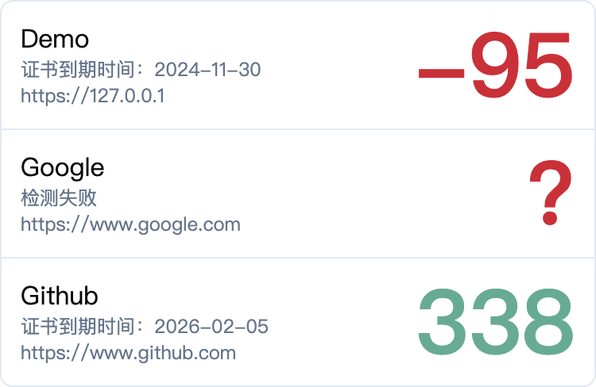

# CertWatcherLite

一个极简的网站安全证书过期监测工具。
用户可以通过配置文件指定一批需要监测的站点，系统将持续检查证书有效性，并通过一个小组件页面进行展示。
如果有需要，也可以通过接口获取数据，定制自己的监控页面。

## 效果展示

### 小组件
小组件可以作为单独的页面查看，也可以通过 iframe 嵌入到其他监控平台中



嵌入代码示例

```html
<iframe src="http://127.0.0.1:2378/widget" 
        style="width: 300px; height: 300px; margin: 0; border: 0; padding: 0; overflow: hidden;"/>
```

### 数据接口

与上图对应的接口数据

```json
[
  {
    "daysRemaining": -95,
    "valid": false,
    "validFrom": "2024-09-01T14:05:57.000Z",
    "validTo": "2024-11-30T14:05:56.000Z",
    "success": true,
    "name": "Demo",
    "remark": "https://127.0.0.1",
    "onlyDaysMatter": false
  },
  {
    "name": "Google",
    "remark": "https://www.google.com",
    "success": false,
    "valid": false,
    "validFrom": "",
    "validTo": "",
    "daysRemaining": 0,
    "onlyDaysMatter": false
  },
  {
    "daysRemaining": 338,
    "valid": true,
    "validFrom": "2025-02-05T00:00:00.000Z",
    "validTo": "2026-02-05T23:59:59.000Z",
    "success": true,
    "name": "Github",
    "remark": "https://www.github.com",
    "onlyDaysMatter": false
  }
]
```

通过访问 `http://127.0.0.1:2378/api/status.json` 即可获取

## 安装

可结合视频 [CertWatcherLite配置与Systemd部署演示](https://www.bilibili.com/video/BV1GG9dYDEsQ/) 阅读下面的说明

1. 在服务器上创建一个目录，将从 release 中下载的二进制文件放到该目录下
2. 给该文件赋予执行权限
   ```bash
   $ chmod +x cwl
   ```
3. 进行初始化，生成配置文件、服务文件和小组件文件
   ```bash
   $ ./cwl init
   $ ls 
   config.json5   cwl   cwl.service   widget.html
   ```
4. 修改配置文件，添加需要检测的站点，详见下方 [配置说明](#配置说明)
5. 启动服务
   ```bash
   $ ./cwl
   ```
   
## 配置说明
配置文件 `config.json5` 为 [json5](https://json5.org/) 格式，额外支持注释等特性，所有合法的 json 都是合法的 json5。

### 配置文件示例

```json5
{
  "host": "0.0.0.0",
  "port": "2378",
  "hosts": [
    {
      "name": "Github",
      "url": "https://www.github.com",
      "remark": "https://www.github.com"
    }
  ]
}
```

### 属性说明
| 属性 | 说明 | 默认值 |
| ---- | ---- | ------ |
| host | 服务监听地址 | 0.0.0.0 |
| port | 服务监听端口 | 2378 |
| hosts | 需要检测的站点 | [] |

#### hosts 属性说明
hosts 是一个站点对象数组，每个站点对象包含以下属性：

| 属性 | 说明                                                                                                       |
| ---- |----------------------------------------------------------------------------------------------------------|
| name | 站点名称，用于展示                                                                                                |
| url | 站点地址，用于监测证书信息，出于隐私考虑，不会在小组件中展示或在接口中返回                                                                    |
| remark | 备注信息，可以用来展示站点的真实地址、维护人员信息或任何其他想要公开展示的内容                                                                  |
| onlyDaysMatter | 系统默认会检测证书是否与域名匹配，证书是否合法等情况。但是对于一些仅供内部使用的自签名证书站点并不适用，如果只需要关注剩余天数，可以添加此属性并设置为 true，系统将忽略证书是否合法，仅根据剩余天数进行判断 |

### 备注
1. 系统会持续监听 `config.json5` 文件的变化，并在文件发生变化后，立即加载 hosts 部分的内容并重新检查证书。
2. 配置文件格式错误或缺少必要字段，可能导致系统异常退出，请确保配置文件格式正确以避免手动重启服务。
3. 修改监听地址和端口，只能通过手动重启服务来生效。

## Systemd 集成

如果你的服务器使用了 `systemd`，可以将初始化时得到的 `cwl.service` 文件复制到 `/etc/systemd/system/` 目录，并执行 `systemctl enable cwl --now` 来启动。
如果你的 systemd 版本还未支持 `--now` 参数，可以执行 `systemctl enable cwl && systemctl start cwl` 来启动。

配置文件中的执行路径 `ExecStart` 是根据你执行初始化命令的地址生成的，如果程序的安装路径有变化，可以执行 `./cwl init` 生成一个新的 `cwl.service` 再覆盖。

## 集成指南
### 小组件集成
小组件可以通过 iframe 或 webview 等形式嵌入到其他监控平台中，示例代码如下：

```html
<iframe src="http://127.0.0.1:2378/widget"
        style="width: 300px; height: 300px; margin: 0; border: 0; padding: 0; overflow: hidden;"/>
```

为了更好的融入其他平台，你可以在初始化得到的 `widget.html` 文件中修改界面样式甚至逻辑来匹配外部需要集成的平台样式。

### 数据接口集成
通过访问 `http://127.0.0.1:2378/api/status.json` 即可获取站点证书信息，返回的数据格式为 json，各字段说明如下：

| 属性             | 说明                                                                           |
|----------------|------------------------------------------------------------------------------|
| name           | 站点名称，由配置文件中 hosts 中的 name 决定                                                 |                                                        |
| remark         | 备注信息，由配置文件中 hosts 中的 remark 决定                                               |                                                             |
| success        | 检测是否成功，当网络异常或站点下线导致系统在 5 秒内无法完成校验时，会认定为检测失败，返回 false，检测失败时小组件中天数会显示成 ？，并红色警告 |
| valid          | 证书是否合法，如果证书尚未生效、已经过期、被吊销、域名不匹配等，会被判定为不合法，返回 false，否则为 true                   |
| validFrom      | 证书生效时间                                                                       |
| validTo        | 证书到期时间                                                                       |
| days           | 证书剩余天数，根据剩余有效期四舍五入到天，证书过期会显示为负数，检测失败                                         |
| onlyDaysMatter | 是否仅关注天数，由配置文件中 hosts 中的 onlyDaysMatter 决定 |                               

## 急救措施
如果 `config.json5` 或 `widget.html` 改崩了，可以在删除该文件后执行 `./cwl init` 重新生成一个对应的文件。

## 细节说明
1. 系统启动后会立刻检测一次证书信息，并开始定时任务，每个整点检测一次，也就是更换网站证书后，要到下个整点才能在系统中反映出来；
2. 系统检测超时时间为 5 秒，如果需要检测的站点出现网络问题，系统也会需要 5 秒以上的时间才能完成启动，更新配置文件的结果也会需要 5 秒以上才能反映出来，请耐心等待；
3. 系统总是将非法、过期、检测失败的证书排在前面，然后再按剩余天数排序，检测失败的站点剩余天数按 0 处理；
4. 非法、过期、检测失败的站点显示成红色，临期的（14天以内）显示成黄色，其他显示成绿色。

## 技术说明
本项目使用 [TypeScript](https://www.typescriptlang.org/) 编写，使用 [esbuild](https://esbuild.github.io/) 构建，并通过 [SEA](https://nodejs.org/api/single-executable-applications.html) 制作可执行文件。

### 开发调试

执行 `pnpm run dev` 进行开发调试，请采用支持 `--experimental-strip-types` 的 Node.js 版本。
代码整体采用 ESM 模块，主入口 index.cts 采用 CJS 模块，这是因为目前 SEA 尚不支持 ESM 模块。

### 发布构建

执行 `pnpm run build` 进行构建，生成的可执行文件将位于 `dist` 目录中，默认脚本根据 Linux_x64 平台构建的。
构建总共有三个步骤：

1. 通过 `esbuild` 将代码合并成一个 `dist/cwl.js` 文件；
2. 通过 `node --experimental-sea-config` 将 `dist/cwl.js` 文件加工成 `dist/cwl.blob` 文件；
3. 通过 `postject` 制作 `dist/cwl` 文件。

构建流程详见 `package.json` 中的 `scripts`

[CertWatcherLite二进制可执行文件打包演示](https://www.bilibili.com/video/BV1TH9dYyECm)

## License
本项目采用 MIT 许可证。在不违反本许可证条款的情况下，您可以自由地使用、复制、修改、合并、出版发行、散布、再授权和/或贩售本软件及该软件的副本。
